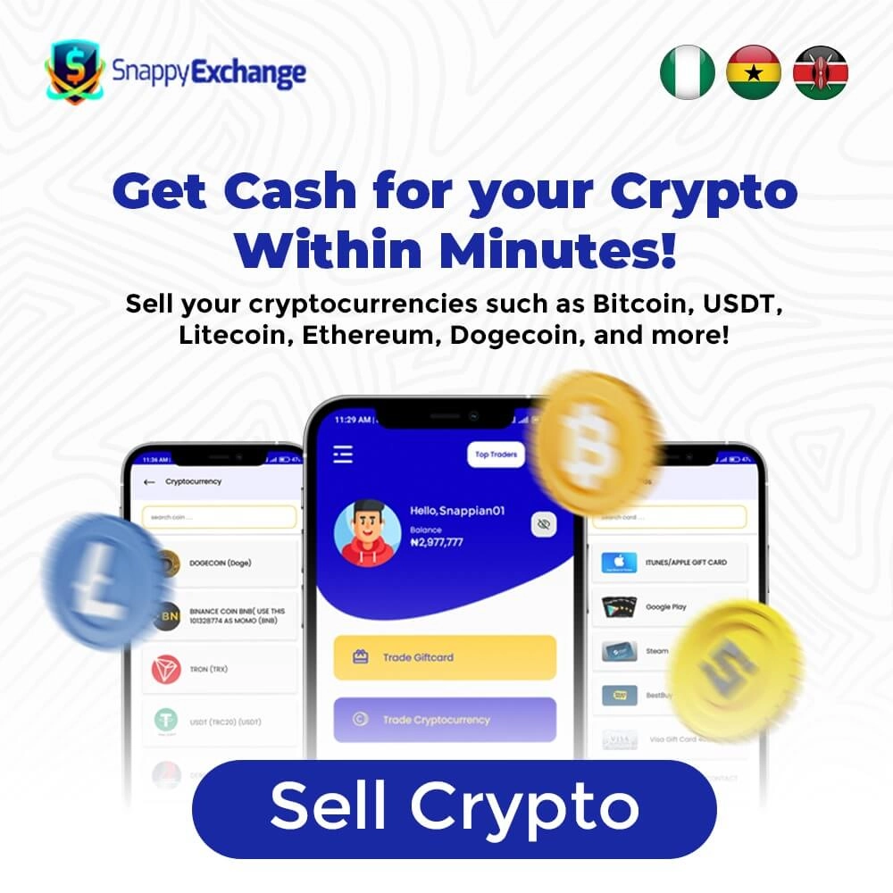

# How to Sell USDT on OKX

Looking to cash out your USDT holdings? Whether you're new to crypto trading or just getting started with OKX, selling USDT doesn't have to feel like rocket science. This guide walks you through the entire process—from account setup to hitting that final "sell" button—so you can convert your digital dollars into other cryptocurrencies or cash without the headache.

---

## What is OKX Anyway?

Think of OKX as one of those big-name crypto exchanges where people go to swap their digital coins around. It's got a clean interface that doesn't make your head spin, solid security measures (always a plus when real money's involved), and enough trading pairs to keep things interesting. Basically, it's become a go-to spot for crypto folks worldwide who want to trade USDT and pretty much any other digital asset you can think of.

## The Step-by-Step Playbook for Selling USDT

Alright, let's get into the actual how-to part. Here's everything you need to do:

### Step 1: Getting Your OKX Account Set Up

First things first—you need an account. Here's the deal:

Visit the OKX website and hit that "Sign Up" button. They'll ask for the usual stuff: email address, password (make it a good one, not "password123"). Check the box agreeing to their terms, finish the registration dance, then head to your inbox to click the verification link they send you. Pretty standard stuff.

### Step 2: The Verification Thing (Yeah, It's Necessary)

Before you can start moving money around, OKX needs to know you're a real person—not someone's cat walking across a keyboard. This is the KYC (Know Your Customer) part that every legit exchange does:

Log into your shiny new account, find the "Account" section, click "Verification," and start filling in your details. They'll want your full name, birthday, address—the works. Then comes the ID upload part: passport, driver's license, whatever official document proves you exist. Submit it all and wait for the OKX team to give you the green light.

### Step 3: Moving Your USDT Into OKX

Got your verification approved? Cool. Now let's get your USDT into the platform:

Log back in, hit the "Assets" tab, then "Deposit." Pick USDT from the cryptocurrency list. You'll see a deposit address pop up—either copy it or scan the QR code if you're feeling fancy. Now go to wherever your USDT currently lives (your wallet, another exchange, wherever) and send it to that address. Then you wait. Blockchain confirmations take a bit, so grab a coffee or something.

### Step 4: Actually Placing Your Sell Order

This is where things get real. Your USDT is sitting pretty in your OKX account, ready to be traded:

Jump over to the trading platform section. Pick your trading pair—maybe BTC/USDT if you want Bitcoin, or ETH/USDT for Ethereum. Hit the "Sell" button. Now decide how much USDT you want to offload. 

Here's where you choose your order type. Market order means "sell it right now at whatever the current price is"—instant but you take what you get. Limit order means "I'll wait for this specific price"—more control but might take longer. Pick your poison, double-check everything (seriously, check it twice), then click "Sell" and watch it happen.

👉 [Ready to start trading with better rates and lower fees? Join OKX now and see the difference](https://www.okx.com/join/47044926)

### Step 5: Watching It All Go Down

Once you've placed that order, you become a spectator to your own trade:

Market orders happen instantly—blink and you'll miss it. Limit orders sit there waiting for the market to hit your price. Either way, you'll see your USDT transform into whatever crypto you picked. It's actually pretty satisfying to watch blockchain technology do its thing.

### Getting Your Money Out

So you've sold your USDT and now you're holding some other cryptocurrency. Maybe you want to move it to your personal wallet for safekeeping:

Head to "Assets" again, find the crypto you just bought, click "Withdraw," paste in your external wallet address, specify how much you want to send, review everything one more time, then confirm. Your funds will start their journey to your wallet. The wait's usually not too bad, but it depends on network congestion.

### Security Stuff You Shouldn't Skip

Look, I get it—security steps feel like extra work. But losing your crypto to some hacker would feel way worse:

Turn on two-factor authentication (2FA). Seriously, just do it. Keep your passwords to yourself—don't share them, don't write them on sticky notes, don't save them in a file called "passwords.txt." Mix letters, numbers, and special characters when creating passwords. Don't click sketchy links in emails claiming to be from OKX. And if you're holding crypto long-term, consider a hardware wallet for that offline security blanket.

## Pro Tips for Not Messing Up

Want to level up your OKX selling game? Here's some wisdom from the trenches:

Keep your finger on the pulse of crypto news. Market trends matter more than you think. OKX gives you charts and indicators—actually use them. They're not just there to look pretty. Set realistic profit targets. Nobody times the market perfectly, so don't expect to. Stop-loss orders are your friend for managing risk. Don't put all your eggs in one basket—explore different trading pairs. And hey, join some crypto communities online. Other traders share useful stuff all the time.

## Why People Like Selling USDT on OKX

There are reasons OKX has become popular for this kind of thing:

The liquidity is solid, meaning you can usually sell whenever you want without waiting around forever. Security's taken seriously with multiple layers of protection. You've got tons of trading pairs to choose from, so you're not stuck with limited options. Plus the platform gives you actual tools to make informed decisions instead of just guessing.

## The Not-So-Great Parts (Because Nothing's Perfect)

Real talk: OKX isn't flawless. Here's what might bug you:

**Regulations Keep Changing:** Crypto rules are still being figured out worldwide. What's allowed today might change tomorrow. Stay informed about regulatory shifts that could affect your trading.

**Security Risks Exist:** Yes, even with good security measures, exchanges can be hacked. Protect your account properly and don't keep more funds on the exchange than you need to.

**Slippage Happens:** When the market's moving fast, the price you see might not be the price you get. That's called slippage, and it's especially common during volatile periods. Your profits can take a hit.

**Cashing Out to Regular Money Can Be Tricky:** Getting your crypto converted to actual dollars or euros isn't always straightforward. Withdrawal options vary, verification might slow things down, and you could face delays accessing your funds.

**Customer Support Sometimes Falls Short:** If something goes wrong, you might wait a while for help. Response times aren't always speedy, and communication can lack clarity when you need answers most.

**Competition Is Fierce:** More people trading USDT means tighter spreads and more sellers competing for buyers. During slow market periods, finding someone to take your trade can get harder.

## A Simpler Alternative: SnappyExchange (If You're in Nigeria)

If all those OKX steps feel like too much, or you specifically want to convert USDT to Naira, check out SnappyExchange. It's designed for direct crypto-to-Naira exchanges without the complicated trading platform stuff.

The process is refreshingly simple: Register on their site, sign in, click "Trade E-Currency," select Tether USDT, enter how much you want to sell and pick your network, hit "Sell Now," transfer your USDT to their address, and boom—Naira hits your account in under five minutes.

Why people like it: Registration takes no time. You actually get to talk to real customer support people. They run promos with trading bonuses. The interface doesn't require a PhD to figure out. Even total newbies can navigate it without stress.

👉 [Looking for the smoothest way to trade USDT? Discover why thousands choose OKX for their crypto needs](https://www.okx.com/join/47044926)

## FAQ

**Is OKX Actually Good or Just Hyped?**

It's legitimately good. OKX ranks among the top crypto exchanges for good reasons—strong security, user-friendly platform, and a massive selection of cryptocurrencies to trade. Whether you're just starting out or you've been in crypto for years, it offers enough features and trading pairs to keep you busy.

---

## Wrapping This Up

So there you have it—the full rundown on selling USDT through OKX. It's not complicated once you've done it once, and now you've got the roadmap to follow from start to finish.

The key is taking it step by step: get your account verified properly, understand how to place orders, keep security tight, and don't rush your decisions. Whether you stick with OKX or explore alternatives like SnappyExchange for Nigerian Naira trades, you've got options.

Crypto trading opens up real opportunities, but approach it with your eyes open. Stay informed about market movements, manage your risks sensibly, and remember that nobody gets every trade right. The exciting part is being part of this digital financial revolution where you actually control your assets. Now go make some smart moves with your USDT—just don't forget everything you learned here.
